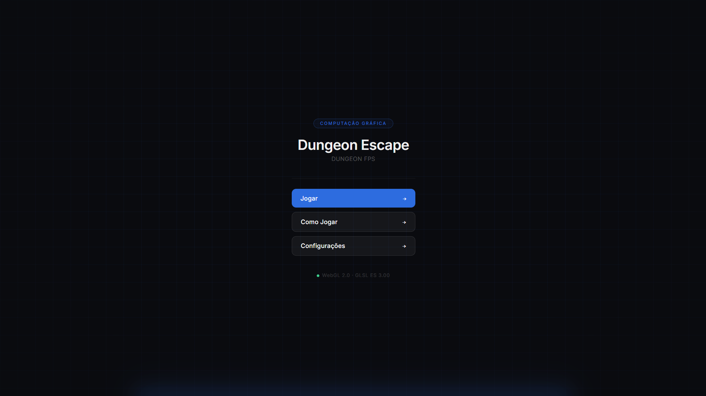

# Dungeon Escape

Jogo FPS 3D desenvolvido como trabalho da disciplina de Computação Gráfica.

O projeto foi desenvolvido utilizando **JavaScript** e **WebGL 2.0**, implementando manualmente grande parte do pipeline gráfico, incluindo carregamento de modelos OBJ, transformações geométricas, shaders GLSL, iluminação pelo modelo de Phong, geração procedural de texturas e renderização em tempo real.

---

# Descrição

Dungeon Escape é um jogo de exploração em primeira pessoa ambientado em uma masmorra subterrânea. O jogador deve sobreviver enfrentando criaturas espalhadas pelo mapa, coletando moedas, abrindo portas e administrando recursos como vida, munição e estamina.

Diferentemente de engines prontas, o projeto implementa diversos componentes fundamentais da Computação Gráfica diretamente sobre a API WebGL, como transformações geométricas 3D, iluminação baseada no modelo de Phong, shaders programáveis, parser próprio para arquivos OBJ e geração procedural de texturas.

---

<div align="center">

## Vídeo de Demonstração

[]((https://youtu.be/KfmeE7MV1D4))

🎥 **Dungeon Escape**  
📺 YouTube  

</div>

---

# Como Jogar

## Objetivo

Explore a masmorra, elimine os monstros, colete moedas para desbloquear portas e sobreviva até encontrar a saída.

---

## Controles

| Ação              | Teclado / Mouse             |
| ----------------- | --------------------------- |
| Andar para frente | **W**                       |
| Andar para trás   | **S**                       |
| Esquerda          | **A**                       |
| Direita           | **D**                       |
| Correr            | **Shift**                   |
| Pular             | **Espaço**                  |
| Atirar            | **Botão Esquerdo do Mouse** |
| Recarregar        | **R**                       |
| Interagir         | **E**                       |
| Pausar            | **ESC**                     |
| Olhar             | **Mouse**                   |

---

## HUD

* ❤️ Barra de Vida
* ⚡ Barra de Estamina
* 🪙 Quantidade de Moedas
* 🔫 Quantidade de Munição
* 👾 Monstros Restantes
* ⭐ Pontuação

---

## Elementos do Cenário

| Elemento            | Descrição                                                                |
| ------------------- | ------------------------------------------------------------------------ |
| 👾 Monstro          | Persegue continuamente o jogador e causa dano por contato.               |
| 🚪 Porta            | Pode ser aberta mediante pagamento de moedas coletadas.                  |
| 🪙 Moeda            | Drop obtido ao eliminar inimigos e utilizada para abrir portas.          |
| ❤️ Kit Médico       | Recupera parte da vida do jogador.                                       |
| 🔫 Caixa de Munição | Reabastece a arma do jogador.                                            |
| 🧱 Dungeon          | Ambiente composto por paredes, piso e teto texturizados proceduralmente. |

---

# Características do Jogo

## Dungeon Procedural

Mapa composto por piso, paredes e teto renderizados utilizando geometrias independentes e texturas procedurais.

---

## Sistema FPS

Controle completo em primeira pessoa utilizando mouse para rotação da câmera e teclado para movimentação.

---

## Sistema de Estamina

A corrida consome estamina continuamente e sua regeneração ocorre automaticamente quando o jogador deixa de correr.

---

## Sistema de Combate

Escopeta com controle de munição, recarga manual, tempo de disparo, alcance máximo e detecção de colisão contra inimigos.

---

## Sistema de Vida

O jogador sofre dano ao colidir com monstros, possui período de invulnerabilidade (iFrames) e pode recuperar vida através dos itens espalhados pelo cenário.

---

## Inteligência dos Monstros

Os monstros rotacionam automaticamente para olhar o jogador e se movimentam continuamente em sua direção.

---

## Sistema de Portas

Portas permanecem bloqueadas até que o jogador possua moedas suficientes para desbloqueá-las.

---

## Sistema de Pickups

Itens de vida, munição e moedas são distribuídos pelo mapa e coletados automaticamente ao se aproximar.

---

## HUD em Tempo Real

Todos os indicadores (vida, estamina, munição, moedas, monstros restantes e pontuação) são atualizados continuamente durante a execução do jogo.

---

## Iluminação Dinâmica

O cenário utiliza iluminação baseada no modelo de Phong, incluindo uma segunda fonte luminosa temporária representando o clarão da arma durante os disparos.

---

# Como Executar

## Pré-requisitos

* Navegador com suporte ao **WebGL 2.0**

---

## Clone o Repositório

```bash
git clone https://github.com/usuario/CaveGame3D.git
cd CaveGame3D
```

---

## Execute

Como o projeto utiliza módulos ES6, recomenda-se executá-lo através de um servidor HTTP local.

Exemplo utilizando VSCode + Live Server:

```
Clique com o botão direito em index.html
Open with Live Server
```

ou

```bash
python -m http.server
```

Acesse:

```
http://localhost:8000
```

---

# Estrutura do Projeto

```
/
├── assets/
│   ├── obj/
│   │   ├── map/
│   │   └── ...
│   ├── textures/
│   └── audio/
│
└── src/
    ├── main.js
    │
    ├── engine/
    │   ├── math/
    │   │   └── mat4.js
    │   ├── renderer/
    │   │   └── webglSetup.js
    │   ├── shaders/
    │   │   └── phongShader.js
    │   └── utils/
    │       └── TextureGenerator.js
    │
    └── game/
        ├── core/
        │   ├── Camera.js
        │   ├── Weapon.js
        │   ├── Monster.js
        │   └── Door.js
        │
        ├── loader/
        │   └── ModelLoader.js
        │
        ├── scenes/
        │   └── DungeonMap.js
        │
        └── ui/
            └── MainMenu.js
```

---

# Implementações Técnicas de Computação Gráfica

## Pipeline de Renderização

| Implementação   | Arquivo                  | Uso                               |
| --------------- | ------------------------ | --------------------------------- |
| WebGL 2.0       | `renderer/webglSetup.js` | Inicialização do contexto gráfico |
| Vertex Shader   | `phongShader.js`         | Transformação dos vértices        |
| Fragment Shader | `phongShader.js`         | Iluminação e texturização         |
| VAO / VBO       | `ModelLoader.js`         | Envio das geometrias para a GPU   |

---

## Transformações Geométricas 3D

Todas as transformações são realizadas através de matrizes homogêneas **4×4**.

| Transformação | Arquivo               | Uso                               |
| ------------- | --------------------- | --------------------------------- |
| Translação    | `engine/math/mat4.js` | Posicionamento dos objetos        |
| Rotação X     | `engine/math/mat4.js` | Rotações no espaço                |
| Rotação Y     | `engine/math/mat4.js` | Orientação dos monstros e objetos |
| Rotação Z     | `engine/math/mat4.js` | Transformações auxiliares         |
| Escala        | `engine/math/mat4.js` | Redimensionamento de objetos      |
| LookAt        | `engine/math/mat4.js` | Construção da View Matrix         |
| Perspectiva   | `engine/math/mat4.js` | Projeção da câmera                |

---

## Iluminação

O projeto implementa o modelo de iluminação de **Phong** diretamente em GLSL.

| Recurso       | Arquivo          | Uso                                         |
| ------------- | ---------------- | ------------------------------------------- |
| Luz Ambiente  | `phongShader.js` | Iluminação mínima da cena                   |
| Luz Difusa    | `phongShader.js` | Intensidade conforme o ângulo da superfície |
| Luz Especular | `phongShader.js` | Reflexos brilhantes                         |
| Muzzle Flash  | `phongShader.js` | Luz dinâmica durante o disparo              |

---

## Texturização

| Implementação        | Arquivo               | Uso                                            |
| -------------------- | --------------------- | ---------------------------------------------- |
| Texturas Procedurais | `TextureGenerator.js` | Geração da pedra, piso e teto                  |
| UV Mapping           | `phongShader.js`      | Aplicação de textura utilizando coordenadas UV |
| Triplanar Mapping    | `phongShader.js`      | Projeção automática de texturas em modelos 3D  |
| Mipmaps              | `TextureGenerator.js` | Melhor qualidade em diferentes distâncias      |

---

## Carregamento de Modelos 3D

O projeto implementa um parser próprio para arquivos OBJ.

| Implementação | Arquivo          | Uso                               |
| ------------- | ---------------- | --------------------------------- |
| Parser OBJ    | `ModelLoader.js` | Leitura manual de arquivos OBJ    |
| Triangulação  | `ModelLoader.js` | Conversão automática de polígonos |
| VAO / VBO     | `ModelLoader.js` | Criação dos buffers da GPU        |

---

## Sistema de Câmera

| Implementação     | Arquivo     | Uso                             |
| ----------------- | ----------- | ------------------------------- |
| Camera FPS        | `Camera.js` | Movimentação em primeira pessoa |
| View Matrix       | `Camera.js` | Transformação Mundo → Câmera    |
| Controle de Mouse | `Camera.js` | Rotação da visão                |
| Colisão com Arena | `Camera.js` | Limites físicos do mapa         |

---

## Arquitetura

O projeto foi organizado de forma modular, separando responsabilidades entre:

* Engine matemática
* Sistema de renderização
* Shaders
* Gerenciamento de modelos
* Sistema de câmera
* Sistema de armas
* Inteligência dos monstros
* Interface do usuário
* Construção da dungeon

Essa divisão facilita manutenção, reutilização de componentes e expansão do projeto.

---

<h2 align="center">Project Contributors</h2>

<p align="center">

<a href="https://github.com/HumDavid">

</a>

<a href="https://github.com/GlaucoCiprianoMoreira">

</a>

<a href="https://github.com/GuilhermeGasparr">

</a>

</p>
